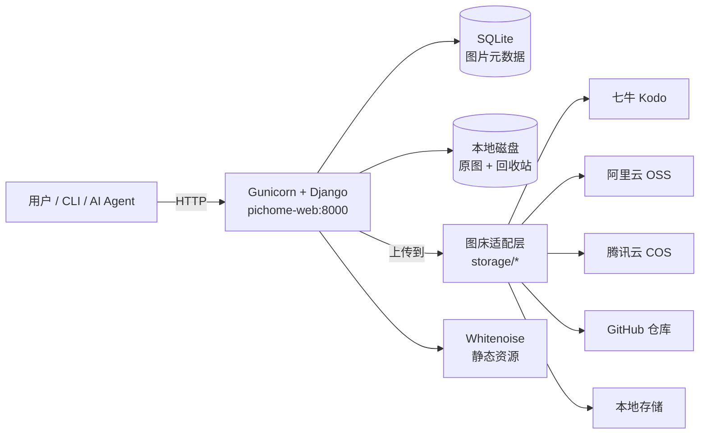
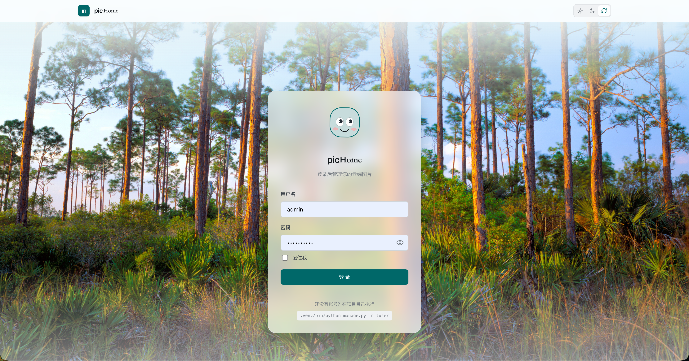
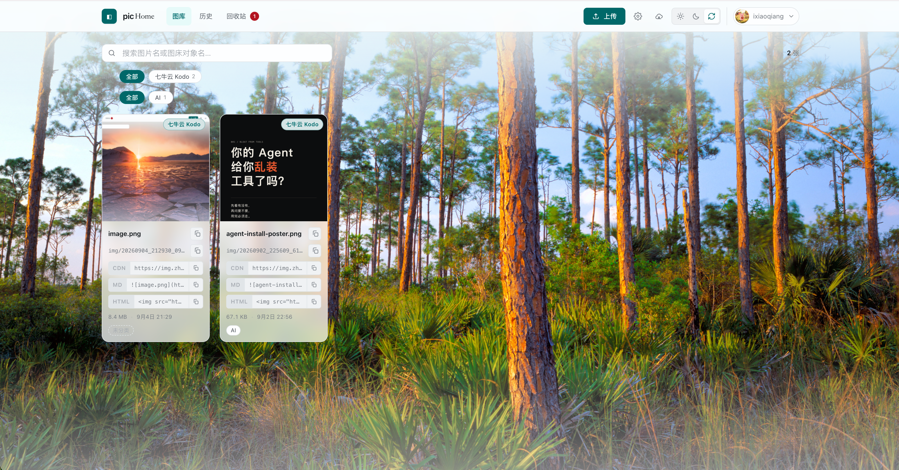
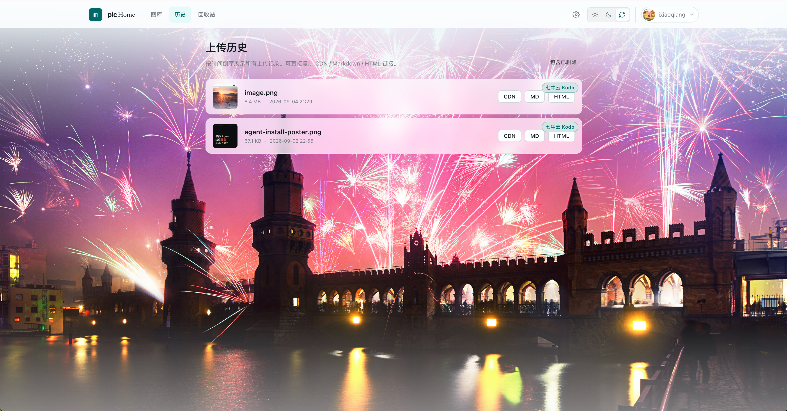
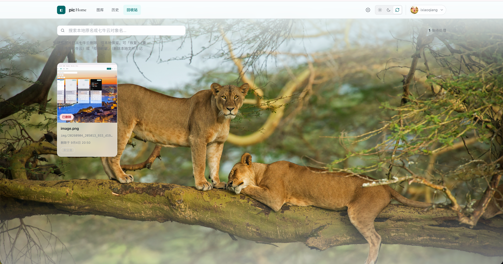
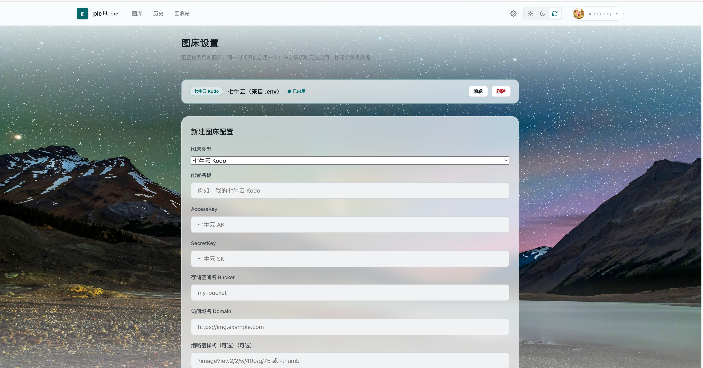

# picHome 🖼️

> **自托管的「多图床」图片管理工具** —— 网页上传、命令行上传、API 上传，一键拿到 CDN / Markdown / HTML 三种链接。
> 支持 **七牛云 Kodo · 阿里云 OSS · 腾讯云 COS · GitHub 仓库 · 本地**，页面上填配置即切换，无需改代码。

[](docker-compose.yml)
[](https://www.python.org)
[](https://www.djangoproject.com)
[](#license)
[](#-给-ai-agent-用的-skill)

---

## ✨ 为什么选 picHome

- **多图床一处管理**：七牛 / 阿里 / 腾讯 / GitHub / 本地，在网页「图床设置」里填配置就能启用，自动渲染表单、校验必填项。
- **四种上传入口，总有一种适合你**：网页拖拽、命令行 `pichome`、HTTP API、AI Agent Skill。
- **链接即取即用**：每张图同时给 **CDN 原图 / Markdown / HTML** 三种链接，逐个一键复制。
- **不怕误删**：删除只移除图床对象，本地文件进回收站，可恢复、可彻底清除。
- **零运维负担**：单机 Docker 镜像自带 Gunicorn + Whitenoise，**不需要 Nginx**，一条命令跑起来。
- **AI 友好**：对外 API 返回标准 JSON，已封装成 AI Agent 可直接调用的 Skill。

---

## 🚀 快速开始（3 分钟跑起来）

> 前提：已安装 [Docker](https://www.docker.com/products/docker-desktop/) 与 Docker Compose v2。

```bash
# 1. 拿代码
git clone https://github.com/<your-org>/pichome.git
cd pichome

# 2. 准备环境变量（图床密钥可留空，之后在网页里配也行）
cp .env.example .env
#    vi .env            # 可选：填七牛/阿里/腾讯的密钥，或用网页配置

# 3. 启动（首次会自动建库、建管理员、收集静态、拉起服务）
docker compose up -d --build
```

启动完成后访问 **http://localhost:28080** 🎉

```
默认管理员账号（请务必登录后第一时间修改密码）：
  用户名：admin
  密码：  admin12345
```

> 不填任何图床密钥也能先跑起来：默认会播种一条「本地」图床，图片存到容器卷里，可立即体验完整上传 / 管理流程。

---

## 🖼️ 网页端：上传与管理

登录后你会看到这几个页面：

| 页面 | 能干啥 |
| --- | --- |
| **图库** | 拖拽 / 点击 / 粘贴（Ctrl+V）上传；按图床、标签、关键词筛选；卡片悬浮预览原图（灯箱）；逐个复制三种链接；批量选择 |
| **历史** | 按时间倒序的全部上传记录，随时复制链接 |
| **回收站** | 已删图片的本地预览；支持**恢复**（重新上传到图床）或**彻底删除** |
| **图床设置** | 增删多个图床、填写密钥、启用 / 停用、字段校验 |

顶栏点**头像 / 昵称**弹出下拉，可进入「用户管理」修改头像、昵称、密码，或退出登录。

---

## ⚙️ 配置图床

两种方式，推荐用网页（最直观）：

**方式 A · 网页配置（推荐）**
进入「图床设置 → 新建」，选择图床类型，按表单填 AccessKey / SecretKey / Bucket / 域名等，保存即生效，无需重启。

**方式 B · 环境变量播种（仅首次）**
在 `.env` 里填 `QINIU_*`（或对应云厂商变量），首次启动的 `initstorage` 命令会自动播种一条启用中的配置；之后以网页配置为准。

```dotenv
# .env 示例（七牛云，仅用于首次播种；网页配置优先）
QINIU_ACCESS_KEY=你的AccessKey
QINIU_SECRET_KEY=你的SecretKey
QINIU_BUCKET=你的bucket
QINIU_DOMAIN=https://你的CDN域名      # 结尾不要带斜杠
QINIU_THUMB_STYLE=?imageView2/2/w/400/q/75
```

> 各云厂商密钥获取地址：七牛云「密钥管理」、阿里云 OSS「AccessKey 管理」、腾讯云 COS「API 密钥」、GitHub「Settings → Developer settings → Personal access tokens」。

---

## 💻 命令行上传（`pichome` CLI）

适合脚本、CI、或把图片从终端直接传上去：

```bash
# 服务已由 docker compose 起着（宿主机端口 28080）时，最常用：
python pichome.py --upload ./photo.png

# 带标签
python pichome.py --upload ./photo.png --tags "风景,旅行"

# 指定服务地址（例如本地 runserver 在 8000）
python pichome.py --upload ./photo.png --url http://127.0.0.1:8000

# 服务设了令牌时
python pichome.py --upload ./photo.png --token "你的API令牌"

# 文件已经在容器里（容器内模式，零网络开销）
docker compose exec -T web python pichome.py --in-process --upload /app/inbox/photo.png
```

返回标准 JSON：`{ "ok": true, "cdn_url": "...", "markdown": "", "html": "" }`。

---

## 🔌 对外 API（给脚本 / AI Agent）

上传接口，方便被外部程序或智能体调用：

```http
POST /api/v1/upload
Content-Type: multipart/form-data

file=@photo.png
tags=风景,旅行          # 可选
token=你的API令牌        # 服务设了 PICHOME_API_TOKEN 时必填
```

```bash
curl -F "file=@photo.png" \
     -F "tags=风景" \
     "http://localhost:28080/api/v1/upload"
```

成功响应（节选）：

```json
{
  "ok": true,
  "cdn_url": "https://cdn.example.com/img/20260904_123000_123_ab12.png",
  "markdown": "",
  "html": ""
}
```

> 安全提示：把服务暴露到公网前，务必在 `.env` 设置 `PICHOME_API_TOKEN`，否则上传接口匿名开放。

---

## 🤖 给 AI Agent 用的 Skill

项目自带 `skills/pichome-upload`，让 AI 助手在对话中不离开上下文就能把图片传上 picHome 并拿回可嵌入链接。

```bash
# 把 skill 交给你的 Agent（以 WorkBuddy / 类 Claude 客户端为例）
# 复制 skills/pichome-upload 到 Agent 的 skills 目录即可启用
cp -r skills/pichome-upload ~/.workbuddy/skills/
```

启用后，Agent 可以这样用（自然语言即可）：

> "把这张图传上 picHome，给我 Markdown 链接"

Agent 会在服务运行时调用 `scripts/pichome.py`，返回 JSON 链接并直接贴进回复。

---

## ☁️ 部署到公网服务器

单机镜像已经够用，部署到服务器只需改两处：

```yaml
# docker-compose.yml 的 web 服务里
environment:
  DJANGO_ALLOWED_HOSTS: "localhost,127.0.0.1,img.example.com,1.2.3.4"  # 加你的域名/IP
  PICHOME_API_TOKEN: "换成一串随机字符串"   # 给上传 API 上锁
```

```bash
docker compose up -d --build
```

- 端口是 `宿主机:容器 = 28080:8000`，改左边即可换访问端口（记得同步 `PICHOME_API_URL`）。
- 数据持久化：`db_data`（SQLite）、`media_data`（原图 + 回收站）两个卷已挂载，**容器删了重建数据不丢**。
- 需要 HTTPS / 域名？在前面加一层 Nginx / Caddy 反代即可，镜像本身不带 Web 服务器。

---

## 🧩 架构一览



**分层设计**：上传核心 `gallery.upload_service` 与 Django 解耦，既能被网页调用，也能被 CLI `--in-process` 直接复用；图床适配层 `gallery/storage/*` 每个图床一个 Provider，新增图床只需写一个类。

---

## 📁 项目结构

```
pichome/
├── docker-compose.yml      # 单机部署
├── Dockerfile              # python:3.13-slim 生产镜像
├── docker-entrypoint.sh    # 迁移→建账号→播种图床→收集静态→启 Gunicorn
├── pichome.py              # 命令行客户端（HTTP / in-process 双模式）
├── requirements.txt
├── .env.example            # 环境变量模板
├── gallery/                # Django 应用
│   ├── models.py           # ImageAsset / StorageConfig / Tag / UserProfile
│   ├── views.py            # 页面 + API + 账户 + 背景代理
│   ├── storage/            # 各图床 Provider（可扩展）
│   ├── templates/          # 服务端渲染模板
│   └── static/             # 原生 HTML/CSS/JS
├── pichome_web/            # Django 工程配置（settings / wsgi）
└── skills/pichome-upload/  # 给 AI Agent 用的上传 Skill
```

---

## 🔧 环境变量速查

| 变量 | 说明 | 默认 |
| --- | --- | --- |
| `QINIU_*` / `ALIYUN_*` / `TENCENT_*` | 各云图床密钥（仅首次播种用） | 空 |
| `PICHOME_API_TOKEN` | 上传 API 令牌，留空 = 不校验（仅内网） | 空 |
| `PICHOME_API_URL` | CLI 默认访问地址 | `http://127.0.0.1:28080` |
| `DJANGO_DEBUG` | 调试模式 | `True`（容器里强制 `False`） |
| `DJANGO_SECRET_KEY` | Django 密钥，生产请改随机串 | 示例值 |
| `DJANGO_ALLOWED_HOSTS` | 允许访问的 host，逗号分隔 | `127.0.0.1,localhost` |
| `DJANGO_DB_PATH` | 数据库文件路径（容器指向持久化卷） | `/app/data/db.sqlite3` |

---

## 🛠️ 本地开发（不用 Docker）

```bash
python -m venv .venv && source .venv/bin/activate
pip install -r requirements.txt
cp .env.example .env
python manage.py migrate
python manage.py inituser          # 建管理员（默认 admin/admin12345）
python manage.py initstorage       # 播种图床配置（读 .env）
python manage.py runserver 0.0.0.0:8000
```

---

## 📸 截图







---

## 🤝 贡献

欢迎 Issue / PR！

1. Fork 并创建特性分支 (`git checkout -b feat/your-feature`)
2. 提交改动 (`git commit -m 'feat: ...'`)
3. 推送 (`git push origin feat/your-feature`)
4. 开 Pull Request

新增一个图床只需在 `gallery/storage/` 下写一个 Provider 类（参考 `aliyun_provider.py`），无需改动其它代码。

---

## 📄 License

[MIT](LICENSE) © picHome contributors

---

<p align="center">用 picHome，让图片去任何你想让它去的地方。</p>
