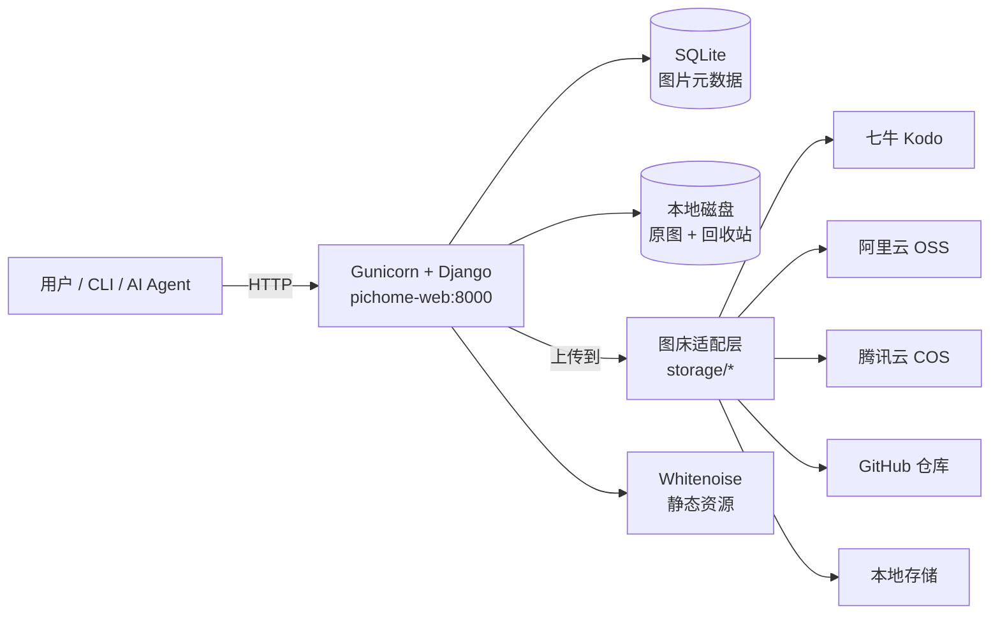

# picHome 🖼️

> **自托管的「多图床」图片管理工具** —— 网页、命令行、API 三种方式上传，一次拿到 CDN / Markdown / HTML 三种链接。
> 支持 **七牛云 Kodo · 阿里云 OSS · 腾讯云 COS · GitHub 仓库 · 本地存储**，在页面上填配置即可切换，无需改代码。

[](https://github.com/ixinglan/picHome/releases)
[](docker-compose.yml)
[](desktop/)
[](https://www.python.org)
[](https://www.djangoproject.com)
[](#-license)
[](#给-ai-agent-用的-skill)

---

## 🌐 在线体验

不想先部署？用**只读演示账号**看看界面（上传 / 删除 / 改配置全部被服务端拦截）：

| 地址 | 用户名 | 密码 |
| --- | --- | --- |
| <https://pichome.zhaojq.top> | `demo` | `demo12345` |

> 只读由服务端中间件 `gallery/middleware.py::DemoReadOnlyMiddleware` 强制实现（`UserProfile.is_demo = True`），前端隐藏按钮只是辅助，改包也绕不过。

---

## ✨ 核心特性

- **多图床一处管理**：七牛 / 阿里 / 腾讯 / GitHub / 本地，网页「图床设置」里填配置即启用，表单自动渲染、必填项自动校验。
- **三种上传入口**：网页拖拽 / 粘贴、命令行 `pichome`、HTTP API。另附 AI Agent Skill。
- **链接即取即用**：每张图同时给 **CDN 原图 / Markdown / HTML** 三种链接，逐个一键复制。
- **不怕误删**：删除只移除图床对象，本地文件进回收站，可恢复（重新上传）也可彻底清除。
- **两种形态**：macOS 原生桌面 App（双击即用）与 Docker 自托管（跨平台、可公网）。
- **零运维负担**：单镜像自带 Gunicorn + Whitenoise，**不需要 Nginx**，一条命令跑起来。
- **AI 友好**：对外 API 返回标准 JSON，已封装成 AI Agent 可直接调用的 Skill。

---

## 🚀 选一种方式开始

| | 🖥️ 桌面客户端 | 🐳 Docker 自托管 |
| --- | --- | --- |
| **适合** | macOS 个人使用，要「双击即用」 | 服务器 / NAS / 多设备共用，需要公网访问 |
| **安装** | 下载 `.dmg` 拖进「应用程序」 | `docker compose up -d --build` |
| **访问** | 独立 App 窗口（后端跑在 `127.0.0.1:14567`） | 浏览器打开 `http://localhost:28080` |
| **数据** | `~/Library/Application Support/pichome` | Docker 数据卷 `db_data` / `media_data` |
| **依赖** | 无 | Docker + Docker Compose v2 |

---

## 🖥️ 方式一：桌面客户端（macOS）

基于 Tauri v2 把同一套 Django 后端（PyInstaller 冻结为 sidecar）打进原生 App，**无需 Docker、无需 Python 环境**。

### 1. 下载与安装

到 [Releases](https://github.com/ixinglan/picHome/releases) 下载对应架构的 dmg：

| 你的 Mac | 下载文件 |
| --- | --- |
| Apple Silicon（M 系列芯片） | `PicHome_<版本>_aarch64.dmg` |
| Intel | `PicHome_<版本>_x64.dmg` |

> 不确定芯片？点左上角 苹果菜单 →「关于本机」，看「芯片」或「处理器」一行。

装好后：双击 dmg → 把 `PicHome.app` 拖进「应用程序」→ 打开。

> 未配置 Apple 开发者签名的版本，首次打开会提示「无法验证开发者」，属正常现象：
> **右键 App → 打开**，或到「系统设置 → 隐私与安全性」点「仍要打开」。

### 2. 首次使用：配置图床

打开 App → 右上角齿轮 →「图床设置」→「新建」，选图床类型，按表单填 AccessKey / SecretKey / Bucket / 域名，保存即生效。

**还没申请云图床？** 直接选「本地存储」就能上传体验；之后新建云图床，再点「同步」把历史图片推上去。

### 3. 端口与数据

| 项 | 值 |
| --- | --- |
| 后端监听 | `127.0.0.1:14567`（仅本机可访问，不对外暴露） |
| 数据目录 | `~/Library/Application Support/pichome`（SQLite + 原图 + 回收站） |
| 最低系统 | macOS 10.15 |

> 桌面版与网页版**数据完全隔离**，可以同时装、互不干扰。

---

## 🐳 方式二：Docker 自托管

> 前提：已安装 [Docker](https://www.docker.com/products/docker-desktop/) 与 Docker Compose v2。

### 快速开始

```bash
# 1. 拿代码
git clone https://github.com/ixinglan/picHome.git
cd picHome

# 2. 准备环境变量（图床密钥可留空，之后在网页里配也行）
cp .env.example .env

# 3. 启动：首次会自动迁移建库、建管理员、收集静态文件
docker compose up -d --build
```

启动完成后访问 <http://localhost:28080>，用默认管理员登录：

```
用户名：admin
密码：  admin12345        ← 请登录后第一时间修改
```

> 不填任何云图床密钥也能跑起来：默认会播种一条「本地存储」，图片落在数据卷里，可立即体验完整上传 / 管理流程。

### 配置图床

**方式 A · 网页配置（推荐）**
登录后进入「图床设置 → 新建」，选择图床类型，填 AccessKey / SecretKey / Bucket / 域名等，保存即生效，无需重启。

**方式 B · 环境变量播种（仅首次启动）**
在 `.env` 里填 `QINIU_*`（或对应云厂商变量），首次启动的 `initstorage` 命令会自动播种一条启用中的配置；之后以网页配置为准。

```dotenv
QINIU_ACCESS_KEY=你的AccessKey
QINIU_SECRET_KEY=你的SecretKey
QINIU_BUCKET=你的bucket
QINIU_DOMAIN=https://你的CDN域名      # 结尾不要带斜杠
QINIU_THUMB_STYLE=?imageView2/2/w/400/q/75
```

> 各云厂商密钥获取入口：七牛云「密钥管理」· 阿里云 OSS「AccessKey 管理」· 腾讯云 COS「API 密钥」· GitHub「Settings → Developer settings → Personal access tokens」。

### 部署到公网服务器

只需改 `docker-compose.yml` 里两处，再 `docker compose up -d --build`：

```yaml
environment:
  DJANGO_ALLOWED_HOSTS: "localhost,127.0.0.1,img.example.com,1.2.3.4"  # 加上你的域名 / 公网 IP
  PICHOME_API_TOKEN: "换成一串随机字符串"                                # 给上传 API 上锁
```

- 端口映射是 `宿主机:容器 = 28080:8000`，改左边即可换对外端口（记得同步 `PICHOME_API_URL`）。
- `db_data`（SQLite）与 `media_data`（原图 + 回收站）是持久化卷，**容器删了重建数据不丢**。
- 需要 HTTPS / 域名？在前面加一层 Nginx / Caddy 反向代理即可 —— 镜像自带 Gunicorn + Whitenoise，不需要额外装 Web 服务器。
- 反向代理记得透传 `X-Forwarded-Proto`，否则 Django 会因 CSRF 校验返回 403。

> ⚠️ **安全提示**：把服务暴露到公网前，务必设置 `PICHOME_API_TOKEN`，否则 `/api/v1/upload` 匿名即可上传。

---

## 🖼️ 界面预览


---

## 💻 上传方式

### 命令行 CLI

仓库自带一个**零依赖单文件脚本** `skills/pichome-upload/scripts/pichome.py`（仅用 Python 标准库，可复制到任意目录使用），适合脚本、CI，或从终端直接把图传上去：

```bash
cd skills/pichome-upload/scripts

# 默认自动探测：桌面 App 开着（14567）就用桌面版，否则回退 Web 版（28080）
python pichome.py --upload /path/to/photo.png

# 强制指定形态（不确定端口时最省事）
python pichome.py --upload /path/to/photo.png --desktop   # 桌面版 14567
python pichome.py --upload /path/to/photo.png --web       # Web 版 28080
python pichome.py --upload /path/to/photo.png --no-probe  # 跳过探测，直接用 Web 版

# 显式指定地址（例如本地 runserver）
python pichome.py --upload /path/to/photo.png --url http://127.0.0.1:8000

# 带标签 / 带令牌（服务设了 PICHOME_API_TOKEN 时）
python pichome.py --upload /path/to/photo.png --tags "风景,旅行"
python pichome.py --upload /path/to/photo.png --token "你的API令牌"
```

> **两种服务形态与端口**：**桌面版 `14567`**（Tauri App 启动即拉起后端）、**Web 版 `28080`**（docker compose 宿主机映射，容器内是 `8000`）。不加参数时脚本会先探测 `14567`，在线则优先用桌面版 —— 所以「打开桌面 App 后让 Agent 上传」无需手动传地址。

返回标准 JSON：

```json
{ "ok": true, "cdn_url": "...", "markdown": "", "html": "" }
```

### HTTP API

方便被外部程序或智能体直接调用：

```bash
curl -F "file=@photo.png" \
     -F "tags=风景" \
     "http://localhost:28080/api/v1/upload?token=你的API令牌"
```

| 项 | 说明 |
| --- | --- |
| 方法 / 路径 | `POST /api/v1/upload` |
| 表单字段 | `file`（必填，单张）、`tags`（可选，逗号分隔） |
| 支持的格式 | `.jpg` `.jpeg` `.png` `.gif` `.webp` `.bmp` `.heic` `.svg` |
| 令牌 | 服务设了 `PICHOME_API_TOKEN` 时必填，三种传法皆可：`?token=`、表单字段 `token`、`Authorization: Bearer <token>` |
| 响应 | `{"ok": true, "cdn_url": ..., "markdown": ..., "html": ...}` |

### 给 AI Agent 用的 Skill

`skills/pichome-upload/` 是一个可直接投喂给 AI 助手的 Skill，让它在对话里不离开上下文就能传图、拿回可嵌入链接：

```bash
# 复制到 Agent 的 skills 目录即可启用（以 WorkBuddy 为例）
cp -r skills/pichome-upload ~/.workbuddy/skills/
```

启用后，自然语言即可：「把这张图传上 picHome，给我 Markdown 链接」。

> Skill 内部调用的就是上面那个脚本（`scripts/pichome.py`），所以端口探测、令牌、标签等行为完全一致，装好即用、无需额外配置。

---

## 🧩 架构一览



**分层设计**：上传核心 `gallery.upload_service` 与 Django 解耦，网页与 CLI `--in-process` 复用同一套逻辑；图床适配层 `gallery/storage/*` 每个图床一个 Provider，新增图床只需写一个类。

**桌面版**：Tauri v2（Rust）壳负责窗口与进程生命周期，启动时 spawn 冻结后的 Django sidecar（waitress 监听 `127.0.0.1:14567`），WebView 直接加载该地址 —— 不打包任何前端构建产物。打包流程见 [`package.md`](package.md)。

---

## 📁 项目结构

```
picHome/
├── gallery/                # Django 应用
│   ├── models.py           # ImageAsset / StorageConfig / Tag / UserProfile
│   ├── views.py            # 页面 + API + 账户
│   ├── upload_service.py   # 上传核心（与 Django 解耦，网页 / CLI 共用）
│   ├── storage/            # 各图床 Provider（可扩展）
│   ├── middleware.py       # 演示账号只读拦截
│   ├── templates/          # 服务端渲染模板
│   └── static/             # 原生 HTML / CSS / JS
├── pichome_web/            # Django 工程配置（settings / wsgi / urls）
├── desktop/                # Tauri v2 桌面壳 + 后端冻结（打包 macOS .app / .dmg）
│   ├── build_backend.sh    # PyInstaller 冻结后端
│   ├── sign_app_bundle.sh  # 深度重签 + framework 结构还原
│   └── notarize.sh         # 公证 + 装订
├── skills/pichome-upload/  # AI Agent Skill（含单文件 CLI 脚本 scripts/pichome.py）
├── docs/                   # 截图
├── Dockerfile              # python:3.13-slim 生产镜像
├── docker-compose.yml      # 单机部署
├── docker-entrypoint.sh    # 迁移 → 建账号 → 播种图床 → 收集静态 → 启 Gunicorn
├── requirements.txt
├── .env.example            # 环境变量模板
└── package.md              # 桌面端打包说明
```

---

## 🔧 环境变量速查

| 变量 | 说明 | 默认 |
| --- | --- | --- |
| `QINIU_*` / `ALIYUN_*` / `TENCENT_*` | 各云图床密钥（仅首次播种用，之后以网页配置为准） | 空 |
| `PICHOME_API_TOKEN` | 上传 API 令牌，留空 = 不校验（**仅限内网**） | 空 |
| `PICHOME_API_URL` | CLI 目标地址（设了就用它，跳过端口探测） | 不设时自动探测：桌面版 `14567` 优先，回退 `28080` |
| `DJANGO_DEBUG` | 调试模式 | `True`（容器内强制 `False`） |
| `DJANGO_SECRET_KEY` | Django 密钥，生产环境请改成随机串 | 示例值 |
| `DJANGO_ALLOWED_HOSTS` | 允许访问的 host，逗号分隔 | `127.0.0.1,localhost` |
| `DJANGO_DB_PATH` | 数据库文件路径（容器指向持久化卷） | `/app/data/db.sqlite3` |

> 桌面版数据目录可用 `PICHOME_DATA_DIR` 覆盖（默认 `~/Library/Application Support/pichome`）。

---

## 🛠️ 本地开发（不用 Docker）

```bash
python -m venv .venv && source .venv/bin/activate
pip install -r requirements.txt
cp .env.example .env
python manage.py migrate
python manage.py inituser            # 建管理员（默认 admin / admin12345）
python manage.py initstorage         # 播种图床配置（读 .env）
python manage.py runserver 0.0.0.0:8000
```

桌面端本地调试：

```bash
cd desktop && npm install && npm run dev     # 会自动先跑 build_backend.sh 冻结后端
```

---

## ❓ 常见问题

| 问题 | 说明 |
| --- | --- |
| 端口 `14567` / `28080` / `8000` 分不清 | 桌面 App `14567`；Docker 对外 `28080`（容器内 `8000`）；本地 `runserver` 默认 `8000` |
| 上传后图片存在哪 | 配置了云图床就传到云端；「本地存储」在容器里（`media_data` 卷）或桌面版数据目录内 |
| 删除图片后云端还在吗 | 从图库删除会**同时移除云端对象**并把本地文件移进回收站；回收站里可恢复 |
| 网页能打开但 POST 报 403 | 反向代理没透传 `X-Forwarded-Proto: https`，Django CSRF 校验不通过 |
| 桌面版装完提示「无法验证开发者」 | 未签名版本属正常，右键 App →「打开」即可，或在「隐私与安全性」里放行 |

---

## 🤝 贡献

欢迎 Issue / PR！

1. Fork 并创建特性分支（`git checkout -b feat/your-feature`）
2. 提交改动（`git commit -m 'feat: ...'`）
3. 推送（`git push origin feat/your-feature`）
4. 开 Pull Request

新增一个图床只需在 `gallery/storage/` 下写一个 Provider 类（参考 `aliyun_provider.py`），无需改动其它代码。

---

## 📄 License

[MIT](LICENSE) © picHome contributors

---

<p align="center">用 picHome，让图片去任何你想让它去的地方。</p>
